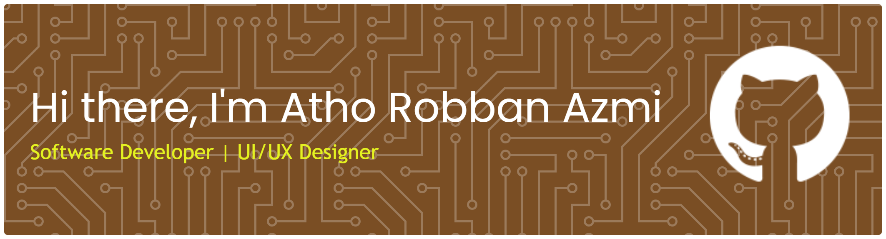

## Hi there, I'm Atho Robban Azmi 👋

##### Software Developer | UI/UX Designer | AI & Web Technology Enthusiast

<!--
**Athorobban/AthoRobban** is a ✨ _special_ ✨ repository because its `README.md` (this file) appears on your GitHub profile.

Here are some ideas to get you started:

- 🔭 I’m currently working on ...
- 🌱 I’m currently learning ...
- 👯 I’m looking to collaborate on ...
- 🤔 I’m looking for help with ...
- 💬 Ask me about ...
- 📫 How to reach me: ...
- 😄 Pronouns: ...
- ⚡ Fun fact: ...
-->

Hi! I'm **Atho**, a web developer from **Kendal, Indonesia**, passionate about building modern, responsive interfaces and crafting great user experiences.  
I focus on **Next.js, TypeScript, Firebase/Supabase**, and **AI-powered applications**—including building smart e-learning platforms and chatbot systems.

## 🚀 Tech Stack

#### **Frontend**

#### **Backend & Database**

#### **Tools & Design**

## 📌 Featured Projects

#### 🔹 **AI Chatbot for E-Learning SD**

A full-stack e-learning website with an integrated AI assistant that helps students learn interactively.  
**Tech:** Next.js, Supabase Auth, Supabase, Gemini API, Tailwind

## 🧩 UI/UX Showcase

Here are some of my design concepts and component systems:

🎨 Design Systems  
📱 Mobile UI Exploration  
💻 Dashboard Layouts  
✏ Wireframes & Prototypes

## 📬 Connect With Me

## ☕ Support My Work

If you like what I build, consider giving a ⭐ on my projects!
